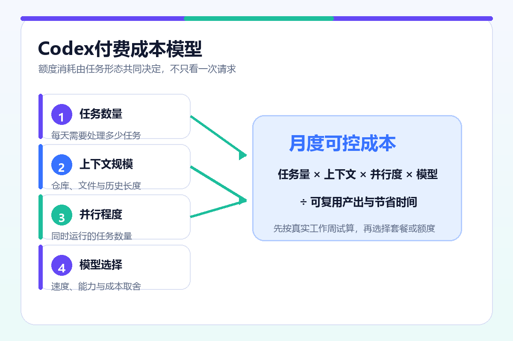

# Codex 付费成本规划器


一个零依赖 Python CLI：读取 CSV 中的任务 token 与自定义费率，输出总成本、逐任务成本、任务类型汇总和计费路径汇总。

> 本工具不内置或声称代表 OpenAI 当前价格。`sample_tasks.csv` 中的费率仅用于演示计算；实际使用前，请从适用于你账户的官方页面或账单导出中填写费率。

这套 Codex 付费规划方法适合在购买或调整方案前做内部试算，也适合在开发周期结束后复盘预算。它不会替用户决定购买哪种套餐，而是把原本模糊的“额度够不够”转换成可以重复计算、可以按任务追踪的数据。

## TL;DR

```bash
python calculator.py
python calculator.py path/to/tasks.csv
```

默认读取仓库内的 `sample_tasks.csv`，输出：

- 所有任务总成本；
- 每个任务的输入、缓存输入、输出和合计成本；
- 按 `task_type` 汇总；
- 按 `billing_path` 汇总；
- 已验收任务数与每个已验收任务平均成本。

建议先复制 `sample_tasks.csv`，将副本替换为自己的任务记录，再把运行结果保存到项目成本说明中。不要直接把示例费率用于真实采购判断。

## 为什么不按“消息数”估算

一次局部代码解释与一次跨模块修复可能都来自一条消息，但上下文、推理、工具调用、输出与重试差异很大。Codex 付费决策更适合以“通过验收的任务”为单位，并把三种路径分开记录：

| 路径 | 典型用途 | 需要单独核对的内容 |
|---|---|---|
| ChatGPT 套餐内额度 | 交互式本地或云端任务 | Usage、重置时间、包含额度 |
| 套餐外 credits | 包含额度用尽后的追加使用 | credits 余额、账户资格、实际消耗 |
| API key | CI、脚本、SDK 与独立预算 | API token 用量与 API 账单 |

个人方案 credits 与 API credits 不是同一余额。认证方式、计费账户和运行路径必须在数据中明确记录。

## 决策模型

仓库采用下面的内部规划模型，而不是官方计费公式：

```text
TaskPressure = Context × LoopLength × ModelFactor × Parallelism × ReworkFactor
```

五个变量分别代表上下文大小、任务闭环长度、模型与推理强度、并行工作数量、失败与返工放大。购买更多额度之前，先缩小无关上下文、明确验收条件并减少重复并行。



## CSV 格式

必需列：

| 列名 | 类型 | 说明 |
|---|---|---|
| `task_id` | 字符串 | 唯一任务标识 |
| `task_type` | 字符串 | 任务类型，用于分组 |
| `billing_path` | 字符串 | 如 `chatgpt-plan`、`credits`、`api-key` |
| `input_tokens` | 非负整数 | 非缓存输入 token |
| `cached_input_tokens` | 非负整数 | 缓存输入 token |
| `output_tokens` | 非负整数 | 输出 token |
| `input_usd_per_million` | 非负小数 | 每百万输入 token 的规划费率 |
| `cached_input_usd_per_million` | 非负小数 | 每百万缓存输入 token 的规划费率 |
| `output_usd_per_million` | 非负小数 | 每百万输出 token 的规划费率 |
| `accepted` | 布尔值 | `true/false`、`yes/no` 或 `1/0` |

计算公式：

```text
task_cost = input_tokens / 1,000,000 × input_rate
          + cached_input_tokens / 1,000,000 × cached_input_rate
          + output_tokens / 1,000,000 × output_rate
```

每行代表一个独立任务，三类 token 分别乘以各自的每百万 token 费率。程序使用十进制定点计算，避免二进制浮点数在金额累计时产生不必要的误差。空字段、负数、重复 `task_id` 或无法识别的 `accepted` 值都会触发错误并以非零状态退出。

## 示例输出

```text
Per-task costs
--------------------------------------------------------------------------------
task_id                      task_type              billing_path       accepted     cost_usd
--------------------------------------------------------------------------------
explain-auth-flow            code-explanation       chatgpt-plan       yes             $0.0223
fix-session-timeout          bugfix                  api-key            yes             $0.1840
refactor-cache-layer         refactor                credits            no              $0.4252
review-payment-module        code-review             chatgpt-plan       yes             $0.0785

Grand total: $0.7100
Accepted tasks: 3/4
Average cost per accepted task: $0.2367
```

实际输出以 `sample_tasks.csv` 为准，金额保留四位小数。CSV 内容错误时，程序会指出具体行号与字段，不会静默跳过。

## 如何阅读运行结果

`Per-task costs` 用于定位单个任务的成本异常。如果某次小修复明显高于同类任务，应回看是否读取了过多文件、进行了多轮失败尝试，或者误用了不合适的计费路径。

`By task type` 用于比较 bugfix、refactor、code-review 等工作类别。它能帮助团队判断究竟是哪类任务值得继续交给代理，而不是仅凭总体金额判断工具是否划算。

`By billing path` 把套餐、credits 与 API key 分开。即使最终需要合并到一个项目预算，也应先保留原始路径，避免把订阅费误当成 API 余额，或把一次性 credits 当作长期包含额度。

`Average cost per accepted task` 使用全部任务成本除以通过验收的任务数。未通过、未合并或被废弃的任务仍然消耗资源，因此会提高该指标。这比只统计成功任务本身的费用更能反映返工成本。

## Codex 付费审核清单

在依据报告调整方案前，逐项确认：

- CSV 费率来自适用于当前账户的官方页面或实际账单，而不是旧文章截图；
- ChatGPT 登录、额外 credits 和 API key 已分别标记；
- `accepted` 有统一标准，例如测试通过并已合并，而不是“生成了代码”；
- 统计周期覆盖至少一个有代表性的开发阶段；
- 高成本任务已经排查无关上下文、重复并行和失败重试；
- 升级收益用减少的工程中断衡量，而不是只比较名义额度。

只有这些数据边界一致，Codex 付费结果才适合用于不同周期、团队或方案之间的比较。

## 官方资料边界

以下结论需要以当前官方页面为准：可用方案、账户是否能购买 credits、具体额度、模型、重置周期和费率。工具只计算你提供的数据，不推断账户资格，也不把 ChatGPT 订阅与 API 账单合并成同一余额。

- [OpenAI Codex Pricing](https://developers.openai.com/codex/pricing)
- [Using Codex with your ChatGPT plan](https://help.openai.com/en/articles/11369540-using-codex-with-your-chatgpt-plan)
- [Using Credits for Flexible Usage in ChatGPT](https://help.openai.com/en/articles/12642688-using-credits-for-flexible-usage-in-chatgpt-freego-pluspro-sora)

完整中文方法论见 `docs/codex-paid-guide.md`。如需对比第三方整理，可进一步阅读 [Codex付费与购买指南](https://kaigpt.ai/blog/codex-buying-guide-for-developers)。该链接不是 OpenAI 官方资料，关键计费信息仍应回到上述官方页面核验。

## FAQ

### 为什么样例费率不是官方当前价格？

费率、模型和促销可能变化，且不同账户可能适用不同路径。示例只验证计算方法，避免把仓库变成过期价格表。

### 买了 ChatGPT Plus，还要记录 API key 用量吗？

需要。使用 API key 的路径按 API 规则计费，不应假设由 ChatGPT 订阅抵扣。建议在 `billing_path` 中明确标记。

### `accepted` 有什么作用？

它表示任务是否通过测试、被合并或实际采用。工具据此计算“每个已验收任务平均成本”，避免把大量未采用输出当作生产率。

### 能处理负数或缺失字段吗？

不能。token、费率必须为非负数，必需字段不能缺失，`task_id` 不能重复。校验失败时程序以非零状态退出。
