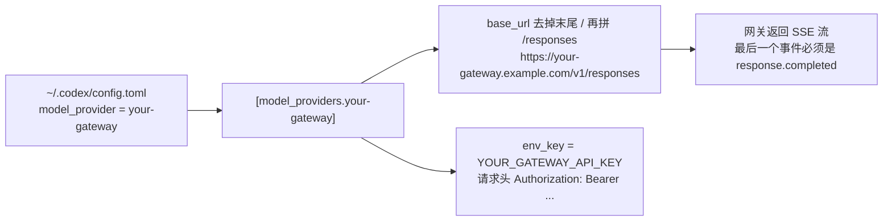

# Codex 中转站 / 第三方 API 配置：config.toml、model_providers 与 wire_api（附自检脚本）

把 Codex CLI 和 IDE 扩展接到第三方 API 中转站、自建代理或企业网关的最小正确配置，前提是它实现了 `POST /v1/responses`。另附一个 `codex-doctor` 自检脚本，逐项指出配置哪里写错；还有一个按 token 估算 API 成本的小工具。

[](https://github.com/gptzzz/codex-custom-provider/actions/workflows/ci.yml)
[](LICENSE)

> **核对日期：2026-09-29**。对照的是 Codex 官方 [Configuration Reference](https://learn.chatgpt.com/docs/config-file/config-reference)，以及 [openai/codex](https://github.com/openai/codex) `rust-v0.158.0`（2026-09-28 发布）的源码。每条事实的出处见 [docs/sources.md](docs/sources.md)。
> English: [README.en.md](README.en.md)

<!-- TOC -->
**目录**

- [先说结论](#先说结论)
- [最小配置](#最小配置)
- [配置是怎么生效的](#配置是怎么生效的)
- [config.toml 逐字段解释](#configtoml-逐字段解释)
- [三种接法怎么选](#三种接法怎么选)
- [自检脚本 codex-doctor](#自检脚本-codex-doctor)
- [怎么判断中转站支持 /v1/responses](#怎么判断中转站支持-v1responses)
- [Codex 接中转站常见报错对照](#codex-接中转站常见报错对照)
- [分平台写法](#分平台写法)
- [多个 provider 并存与切换](#多个-provider-并存与切换)
- [已实测示例：GPTZZZ](#已实测示例gptzzz)
- [估算 API key 路径的成本](#估算-api-key-路径的成本)
- [常见问题](#常见问题)
  - [配好中转站以后，Codex 为什么还是走 OpenAI 官方？](#配好中转站以后codex-为什么还是走-openai-官方)
  - [wire_api = "chat" 还能用吗？](#wire_api--chat-还能用吗)
  - [auth.json 里写 OPENAI_API_KEY 和用 env_key 有什么区别？](#authjson-里写-openai_api_key-和用-env_key-有什么区别)
  - [报 stream disconnected before completion 怎么办？](#报-stream-disconnected-before-completion-怎么办)
  - [VS Code 扩展要单独配置吗？](#vs-code-扩展要单独配置吗)
  - [这个仓库会收集我的 key 吗？](#这个仓库会收集我的-key-吗)
- [仓库结构](#仓库结构)
- [从 codex-cost-planner 升级而来](#从-codex-cost-planner-升级而来)
- [参与贡献与许可证](#参与贡献与许可证)
<!-- /TOC -->

## 先说结论

1. **只有用户级配置能设置 provider。** 写在 `~/.codex/config.toml` 里才生效；设置了 `CODEX_HOME` 时是 `$CODEX_HOME/config.toml`。项目里的 `.codex/config.toml` 如果写了 `model_provider` 或 `model_providers`，Codex 会忽略，并在启动时提示 `Ignored unsupported project-local config keys`。[出处](https://learn.chatgpt.com/docs/config-file/config-advanced)
2. **provider ID 不能用 `openai`、`ollama`、`lmstudio`。** 这三个是内置 ID。写了 `[model_providers.openai]`，Codex 会直接拒绝启动，报错 `model_providers contains reserved built-in provider IDs`。[出处](https://learn.chatgpt.com/docs/config-file/config-reference)
3. **`base_url` 写到 `/v1` 为止。** Codex 先去掉末尾的 `/`，再自己拼上 `/responses`。所以写成 `.../v1/responses` 或 `.../v1/v1` 都会 404。[出处](https://github.com/openai/codex/blob/rust-v0.158.0/codex-rs/codex-client/src/provider.rs)
4. **`wire_api` 只支持 `"responses"`，省略时默认也是它。** `"chat"` 已在 2026 年 2 月移除，因此网关必须实现 `POST /v1/responses`。只提供 `/v1/chat/completions` 的中转站接不了 Codex。[出处](https://github.com/openai/codex/discussions/7782)
5. **key 通过 `env_key` 从环境变量读取。** `env_key` 填的是环境变量的**名字**，key 本身放在这个变量里，不写进任何配置文件。[出处](https://learn.chatgpt.com/docs/config-file/environment-variables)

## 最小配置

把下面的内容写进 `~/.codex/config.toml`（Windows 是 `%USERPROFILE%\.codex\config.toml`），再把 `your-gateway`、域名和模型 ID 换成你自己的。完整模板见 [config/config.toml.example](config/config.toml.example)。

```toml
# 顶层键必须写在第一个 [表] 之前
model = "your-model-id"            # GET <base_url>/models 返回的 ID
model_provider = "your-gateway"    # 对应下面的表名

[model_providers.your-gateway]
name = "Your Gateway"                             # 不能为空
base_url = "https://your-gateway.example.com/v1"  # 到 /v1 为止
env_key = "YOUR_GATEWAY_API_KEY"                  # 环境变量名，不是 key 本身
wire_api = "responses"                            # 唯一支持的取值
```

然后依次执行：

```bash
read -rs YOUR_GATEWAY_API_KEY && export YOUR_GATEWAY_API_KEY   # 输入 key，不回显，不进 shell 历史
bash scripts/codex-doctor.sh                                    # 离线自检，不发请求
bash scripts/codex-doctor.sh --live                             # 可选：真的请求一次 /responses（会计费）
codex exec "Reply with the single word: ready"                  # 不进 TUI 的冒烟测试
```

长期保存 key、Windows 的写法、VS Code 扩展的注意点，分别见 [docs/macos-linux.md](docs/macos-linux.md)、[docs/windows.md](docs/windows.md) 和 [docs/vscode-extension.md](docs/vscode-extension.md)。

## 配置是怎么生效的



Codex 按下面的顺序合并配置，前面的覆盖后面的（[Config basics](https://learn.chatgpt.com/docs/config-file/config-basic)）：

1. 命令行参数和 `-c key=value`
2. 项目里的 `.codex/config.toml`：只在信任的项目里加载，而且其中的 provider 相关键会被忽略
3. `--profile <名字>` 选中的 `~/.codex/<名字>.config.toml`
4. 用户级 `~/.codex/config.toml`
5. 工作区下发的云端配置、`/etc/codex/config.toml`（Unix）、内置默认值

想确认最终生效的是哪一层，在 Codex 里输入 `/debug-config`；看当前模型和 provider，用 `/status`。

## config.toml 逐字段解释

表中内容对照 [Configuration Reference](https://learn.chatgpt.com/docs/config-file/config-reference) 和源码 [`model-provider-info/src/lib.rs`](https://github.com/openai/codex/blob/rust-v0.158.0/codex-rs/model-provider-info/src/lib.rs)，核对日期 2026-09-29。

| 字段 | 写在哪 | 取值 / 默认值 | 说明 |
|---|---|---|---|
| `model` | 顶层 | 字符串 | 发给网关的模型 ID。各家网关命名不同，以 `GET <base_url>/models` 为准 |
| `model_provider` | 顶层 | 默认 `openai` | 指向 `[model_providers.<id>]`，必须和表名完全一致 |
| `model_reasoning_effort` | 顶层 | 如 `low` `medium` `high` `xhigh` `max` | 能用哪些档位取决于模型和网关，不支持的档位会被网关拒绝 |
| `[model_providers.<id>]` | 表 | — | 自定义 provider。`<id>` 不能是 `openai`、`ollama`、`lmstudio` |
| `name` | provider 表 | 字符串，**不能为空** | 显示名。为空时报错 `provider name must not be empty` |
| `base_url` | provider 表 | URL | API 根地址，一般写到 `/v1`。不写的话，请求会发往 `https://api.openai.com/v1` |
| `env_key` | provider 表 | 环境变量名 | 从这个变量读 key，作为 `Authorization: Bearer <key>` 发出。变量不存在或为空时报 `Missing environment variable` |
| `env_key_instructions` | provider 表 | 字符串 | 变量缺失时附在报错后面的提示文字 |
| `wire_api` | provider 表 | 只能是 `responses`（默认） | 写 `chat` 会报错 `` `wire_api = "chat"` is no longer supported `` |
| `stream_idle_timeout_ms` | provider 表 | 默认 `300000` | SSE 流超过这么久没有数据就算断开 |
| `stream_max_retries` | provider 表 | 默认 `5` | 流中断后的重连次数 |
| `request_max_retries` | provider 表 | 默认 `4` | HTTP 请求失败的重试次数 |
| `http_headers` / `env_http_headers` | provider 表 | 表 | 固定请求头；或者请求头的值从环境变量读取 |
| `query_params` | provider 表 | 表 | 附加的查询参数，比如 Azure 的 `api-version` |
| `requires_openai_auth` | provider 表 | 默认 `false` | 设为 `true` 时走 OpenAI 登录流程：首次运行出现登录界面，凭据存进 `auth.json`。默认 `false` 时跳过登录，key 从 `env_key` 读取 |
| `experimental_bearer_token` | provider 表 | 字符串 | 把 key 直接写进配置文件，官方不推荐，建议用 `env_key` |
| `[model_providers.<id>.auth]` | provider 子表 | `command`、`args` 等 | 运行一条命令取 token，比如从系统钥匙串读取。不能和 `env_key` 同时使用 |
| `supports_websockets` | provider 表 | 自定义 provider 默认 `false` | 网关是否支持 Responses 的 WebSocket 传输。默认走 HTTP SSE |
| `openai_base_url` | 顶层 | URL | 另一种接法：不新建 provider，只改内置 `openai` provider 的地址，见下一节 |

> 忘了某个键叫什么，或者怀疑写错了键名，可以用 `codex --strict-config` 启动。Codex 遇到不认识的键会直接报错，而不是默默忽略。

## 三种接法怎么选

| 接法 | 写法 | key 从哪来 | 适合 |
|---|---|---|---|
| **自定义 provider（推荐）** | `model_provider = "your-gateway"` 加上 `[model_providers.your-gateway]` | `env_key` 指定的环境变量 | 第三方网关、中转站，以及有独立 key 的自建代理 |
| 只改内置 openai 的地址 | 顶层 `openai_base_url = "https://.../v1"` | `codex login` 保存的凭据（ChatGPT 登录或 OpenAI API key） | 你自己控制、放在 OpenAI 前面的代理，或者数据驻留项目 |
| `requires_openai_auth = true` 加 `auth.json` | 自定义 provider，但 key 用 `codex login --with-api-key` 存进登录缓存 | `~/.codex/auth.json` 或系统钥匙串 | 不推荐：第三方 key 会和 ChatGPT 登录共用同一份登录缓存 |

第二种接法要注意：内置 `openai` provider 用的是 `codex login` 的凭据（源码里 `requires_openai_auth: true`）。`openai_base_url` 指向第三方网关时，这份凭据会随请求一起发到那个网关。所以第三方网关请用第一种。

## 自检脚本 codex-doctor

[scripts/codex-doctor.sh](scripts/codex-doctor.sh) 支持 macOS 自带的 bash 3.2 和 Linux；Windows 用 [scripts/codex-doctor.ps1](scripts/codex-doctor.ps1)，支持 PowerShell 5.1 和 7。默认不联网。

```bash
bash scripts/codex-doctor.sh                       # 检查 ~/.codex/config.toml（或 $CODEX_HOME）
bash scripts/codex-doctor.sh --profile work        # 同时叠加 ~/.codex/work.config.toml
bash scripts/codex-doctor.sh --config ./my.toml    # 检查指定文件
bash scripts/codex-doctor.sh --live                # 另外请求 GET /models 和一次流式 POST /responses
```

```powershell
powershell -ExecutionPolicy Bypass -File scripts\codex-doctor.ps1          # -ExecutionPolicy 只对这一次运行有效
powershell -ExecutionPolicy Bypass -File scripts\codex-doctor.ps1 -Live
```

配置正确时的输出：

```text
codex-doctor 2.0.0 (bash 3.2.57)
 1    PASS  codex CLI        codex-cli 0.158.0
 2    PASS  config file      /Users/me/.codex/config.toml (default)
 3    PASS  TOML parse       read with the fallback line parser (basic syntax checks only; Python 3.11+ enables strict parsing)
 4    PASS  key order        top-level keys come before the first table (line 23)
 5    PASS  model_provider   model_provider = your-gateway, model = your-model-id
 6    PASS  provider table   [model_providers.your-gateway] name = "Your Gateway"
 7    PASS  base_url         requests go to https://your-gateway.example.com/v1/responses
 8    PASS  wire_api         "responses" (the gateway must implement POST /v1/responses)
 9    PASS  credentials      $YOUR_GATEWAY_API_KEY is set (length 43)
 10   PASS  ignored keys     no project-level provider keys, no legacy profiles (searched from /Users/me/code/my-app)
 11a  SKIP  live /models     not run (add --live)
 11b  SKIP  live /responses  not run (add --live; sends one small billed request)

Summary: 10 PASS, 0 WARN, 0 FAIL, 2 SKIP
```

`/v1` 写了两遍、环境变量也没设置时的输出：

```text
 7    FAIL  base_url         "https://your-gateway.example.com/v1/v1" repeats /v1; requests would go to https://your-gateway.example.com/v1/v1/responses
                             fix: keep exactly one /v1 at the end
 9    FAIL  credentials      Missing environment variable: `YOUR_GATEWAY_API_KEY`.
                             fix: export YOUR_GATEWAY_API_KEY=... in the shell (or IDE) that starts Codex; see docs/macos-linux.md or docs/windows.md

Summary: 8 PASS, 0 WARN, 2 FAIL, 2 SKIP
```

各项检查的内容：

| # | 检查什么 | FAIL / WARN 的典型原因 |
|---|---|---|
| 1 | `codex --version` | 没装 Codex（WARN，配置仍会检查）；版本低于 0.134.0（WARN） |
| 2 | 配置文件位置 | 文件不存在；`CODEX_HOME` 指向的目录不存在；文件被存成了 `config.toml.txt` |
| 3 | TOML 语法 | 有 Python 3.11+ 时用 `tomllib` 严格解析，否则用内置的行解析器，能查出未闭合的引号和重复的键 |
| 4 | 顶层键的位置 | `model`、`model_provider` 写在了某个 `[表]` 后面，TOML 会把它们算进那个表 |
| 5 | `model_provider` | 没写；定义了保留 ID 的表（`openai` 等）；`model` 没写（WARN） |
| 6 | provider 表 | `[model_providers.<id>]` 不存在或 `name` 为空；有 Codex 不认识的键，比如 `api_key`（WARN） |
| 7 | `base_url` | 缺失；`/v1/v1`；末尾已经带了 `/responses`；带查询参数；明文 http（WARN）；不以 `/v1` 结尾（WARN） |
| 8 | `wire_api` | 写成了 `chat` 或其他值 |
| 9 | 凭据 | 变量未设置；`env_key` 里填的是 key 本身；key 带引号或空格（WARN）。只打印 key 的长度 |
| 10 | 被忽略的键 | 项目级 `.codex/config.toml` 里有 provider 键（WARN）；旧版的 `profile = "..."`（FAIL）或 `[profiles.*]`（WARN） |
| 11a | `GET /models`（仅 `--live`） | 401/404；配置里的模型不在列表中（WARN） |
| 11b | 流式 `POST /responses`（仅 `--live`） | 404（网关没有 Responses API）；流没有以 `response.completed` 结尾；返回的是 JSON 而不是 SSE |

退出码等于 FAIL 的数量，可以直接放进 CI 或脚本。key 通过标准输入交给 curl，不出现在进程列表里；从响应里打印的内容也会先把 key 替换掉。各项 FAIL 怎么修，见 [docs/errors.md](docs/errors.md)。

## 怎么判断中转站支持 /v1/responses

Codex 发的是 `stream: true` 的 `POST <base_url>/responses`，并且要求流以 `response.completed` 事件结束。用 curl 就能验证（会产生一次很小的计费）：

```bash
curl -sS -N "https://your-gateway.example.com/v1/responses" \
  -H "Authorization: Bearer $YOUR_GATEWAY_API_KEY" \
  -H "Content-Type: application/json" \
  -d '{"model":"your-model-id","input":"Reply with the single word: pong","stream":true}'
```

支持的网关会返回一串 `event:` / `data:` 行，最后一个事件是：

```text
event: response.completed
data: {"type":"response.completed","response":{"id":"resp_...","status":"completed",...,"usage":{"input_tokens":...,"output_tokens":...,"total_tokens":...}}}
```

返回 404 或 `Invalid URL`，说明网关没有 Responses API；流中途断掉、没有 `response.completed`，Codex 会报 `stream disconnected before completion`。非流式检查、工具调用检查和结果判读，见 [docs/check-responses-support.md](docs/check-responses-support.md)。`codex-doctor.sh --live` 的 11b 做的就是这项检查。

## Codex 接中转站常见报错对照

| 现象（Codex 的报错原文） | 最常见的原因 | 怎么修 |
|---|---|---|
| `unexpected status 401 Unauthorized` | key 错了，或者启动 Codex 的那个 shell / IDE 里没有这个环境变量 | [docs/errors.md#401](docs/errors.md#401) |
| ``Missing environment variable: `X`.`` | `env_key` 指向的变量不存在，或者 `env_key` 里直接填了 key | [docs/errors.md#missing-environment-variable](docs/errors.md#missing-environment-variable) |
| `unexpected status 404 ... url: .../v1/v1/responses` | `base_url` 写了两遍 `/v1`，或者末尾带了 `/responses` | [docs/errors.md#404-v1-v1](docs/errors.md#404-v1-v1) |
| `/responses` 返回 404 或 405 | 网关只有 Chat Completions，没有 Responses API | [docs/errors.md#responses-404](docs/errors.md#responses-404) |
| `stream disconnected before completion: ...` | 网关或它前面的反向代理截断、缓冲了 SSE；长时间推理超过了空闲超时 | [docs/errors.md#stream-disconnected](docs/errors.md#stream-disconnected) |
| 400 / 404，报错里带 `model` | 模型 ID 不在这个网关（或这个 key 分组）的列表里 | [docs/errors.md#model-not-found](docs/errors.md#model-not-found) |
| 配置了网关，Codex 还是弹出 ChatGPT 登录，或者还在走 OpenAI | 配置写在了项目级 `.codex/config.toml`；或者顶层键写在了表后面 | [docs/errors.md#project-config-ignored](docs/errors.md#project-config-ignored)、[docs/errors.md#toml-key-order](docs/errors.md#toml-key-order) |
| ``Model provider `x` not found`` | `model_provider` 和 `[model_providers.x]` 的名字不一致 | [docs/errors.md#provider-not-found](docs/errors.md#provider-not-found) |
| `model_providers contains reserved built-in provider IDs` | 自定义表用了 `openai`、`ollama`、`lmstudio` | [docs/errors.md#reserved-id](docs/errors.md#reserved-id) |

完整列表见 [docs/errors.md](docs/errors.md)：每条都写了现象、原因、验证命令和修复方法，一共 15 条。

## 分平台写法

- **macOS / Linux**：[docs/macos-linux.md](docs/macos-linux.md)。包括 zsh、bash、fish 下怎么设置变量，用 macOS 钥匙串配合 `auth.command` 取 key 从而不写明文，以及 SSH 和无界面服务器的情况。
- **Windows**：[docs/windows.md](docs/windows.md)。包括 `%USERPROFILE%\.codex`、PowerShell 的会话变量和用户变量、`config.toml.txt` 的坑、UTF-8 编码，以及 WSL 里配置和变量要另写一份。
- **VS Code 等 IDE 扩展**：[docs/vscode-extension.md](docs/vscode-extension.md)。扩展和 CLI 读的是同一份配置，但环境变量要在扩展能看到的地方设置。

## 多个 provider 并存与切换

从 Codex 0.134.0 起，profile 改成了单独的文件 `~/.codex/<名字>.config.toml`，用 `codex --profile <名字>` 选中。`[profiles.<名字>]` 表和顶层的 `profile = "..."` 都不再读取，后者还会直接报错（[Advanced Configuration](https://learn.chatgpt.com/docs/config-file/config-advanced)）。网上很多教程仍是旧写法。

推荐做法：把所有 provider 都定义在基础配置里，profile 文件只改 `model_provider` 和 `model`。

```text
~/.codex/config.toml               # gateway-a（默认）和 gateway-b 两个 provider 都定义在这里
~/.codex/gateway-b.config.toml     # model_provider = "gateway-b"
~/.codex/chatgpt.config.toml       # model_provider = "openai"，临时切回 ChatGPT 登录
```

```bash
codex                                           # 默认 provider
codex --profile gateway-b                       # 换网关
codex -c model_provider='"gateway-b"' -m other-model-id "..."   # 只换这一次
```

示例文件见 [config/profiles/](config/profiles/README.md)。

## 已实测示例：GPTZZZ

这里只列维护者自己实测过的网关，不接受第三方网关的收录请求。维护者运营 GPTZZZ，所以目前只有它一个（见页脚的披露）。

配置文件是 [config/gptzzz.toml](config/gptzzz.toml)：`base_url = "https://gptzzz.ai/v1"`，`env_key = "GPTZZZ_API_KEY"`，`wire_api = "responses"`。它可以直接当主配置用，也可以复制成 `~/.codex/gptzzz.config.toml`，再用 `codex --profile gptzzz` 选中。

2026-09-29 用真实 key 实测的结果：

| 项目 | 结果 |
|---|---|
| `GET /v1/models` | 通过 |
| `POST /v1/responses` | 通过 |
| 流式 `POST /v1/responses`（Codex 实际发出的请求，`codex-doctor.sh --live` 第 11b 项） | 通过：2026-09-29 复测，`gpt-5.6-terra`，9 个 SSE 事件，以 `response.completed` 结束，带 `usage` |
| 错误的 key | HTTP 401，响应体是 `{"code":"INVALID_API_KEY","message":...}`，和 OpenAI 的 `{"error":{...}}` 结构不同 |
| 推理档位 | `gpt-5.6`、`gpt-5.6-sol`、`gpt-5.6-terra` 接受 `none` 到 `max`；`gpt-6-astra` 接受 `low` 到 `max`，传 `none` 会被拒绝；以上模型都不接受 `minimal`。其余模型没有逐档测过，以网关报错为准 |
| 对话模型 ID | `gpt-6`、`gpt-6-sol`、`gpt-6-luna`、`gpt-6-astra`、`gpt-5.6`、`gpt-5.6-sol`、`gpt-5.6-terra`、`gpt-5.6-luna`、`gpt-5.5`、`gpt-5.4`、`gpt-5.4-mini`（同日复测时另列出 `gpt-5.2`、`gpt-5.3-codex-spark`，没有测；以你的 key 调 `/v1/models` 的结果为准） |
| Embeddings | 不提供 |

`config/gptzzz.toml` 另外通过了 doctor 的全部离线检查，CI 每次都会重跑（见 [tests/test_doctor.py](tests/test_doctor.py)）。用你自己的 key 时，建议先跑 `bash scripts/codex-doctor.sh --live`，再用 `codex exec` 做一次端到端确认。

## 估算 API key 路径的成本

用 API key（或第三方网关）跑 Codex 是按 token 计费的。[cost/calculator.py](cost/calculator.py) 是零依赖的 Python 脚本：读入一个 CSV，每行一个任务，写明输入、缓存输入、输出三类 token 和各自的单价，输出每个任务的成本、按任务类型和计费路径的汇总，以及「每个通过验收的任务平均花多少钱」。

```bash
python3 cost/calculator.py                   # 跑自带的 cost/sample_tasks.csv
python3 cost/calculator.py my_tasks.csv      # 跑你自己的记录
```

```text
Grand total: $0.7100
Accepted tasks: 3/4
Average cost per accepted task: $0.2367
```

示例 CSV 里的单价只是用来演示计算的，不是任何一家的真实价格。单价请从你自己的账单或服务商价格页填写。CSV 的格式、计费路径怎么分，以及为什么要按「通过验收的任务」计算，见 [cost/README.md](cost/README.md) 和 [docs/cost-planning.md](docs/cost-planning.md)。

## 常见问题

### 配好中转站以后，Codex 为什么还是走 OpenAI 官方？

多半是 `model_provider` 没有生效。常见原因有三个：配置写在了项目级 `.codex/config.toml`；`model_provider` 写在了某个 `[表]` 的后面；profile 用的是旧的 `[profiles.x]` 写法。跑一遍 `codex-doctor`，第 4、5、10 项会直接指出是哪一个。

### `wire_api = "chat"` 还能用吗？

不能。Codex 从 2026 年 2 月起移除了 Chat Completions 支持，现在只接受 `responses`（[openai/codex#7782](https://github.com/openai/codex/discussions/7782)）。网关不支持 `/v1/responses` 的话，就换一个支持的网关。

### `auth.json` 里写 `OPENAI_API_KEY` 和用 `env_key` 有什么区别？

`auth.json` 是 `codex login` 的登录缓存（也可能存在系统钥匙串里）。provider 设置了 `requires_openai_auth = true`，Codex 才会对它走这套登录流程；默认不走，key 从 `env_key` 读取。`env_key` 让每个 provider 从各自的环境变量读 key，互不影响，也不会覆盖你的 ChatGPT 登录。第三方网关建议用 `env_key`。

### 报 `stream disconnected before completion` 怎么办？

先用 `codex-doctor.sh --live` 看 11b：失败说明网关的流不完整，要找网关或它前面的反向代理解决。11b 通过、但长任务仍然断，可以把 `stream_idle_timeout_ms` 调大。详见 [docs/errors.md#stream-disconnected](docs/errors.md#stream-disconnected)。

### VS Code 扩展要单独配置吗？

不用，扩展和 CLI 读同一份配置。但从 Dock 或开始菜单启动的 VS Code 不一定能看到你在终端里设置的环境变量。见 [docs/vscode-extension.md](docs/vscode-extension.md)。

### 这个仓库会收集我的 key 吗？

不会。脚本只从环境变量读取 key，只打印它的长度；默认不联网；`--live` 只请求你在 `base_url` 里填的地址。

## 仓库结构

```text
config/
  config.toml.example          通用最小配置
  gptzzz.toml                  已实测示例
  profiles/                    多 provider 并存和切换（0.134+ 的 profile 文件）
scripts/
  codex-doctor.sh              自检脚本（bash 3.2+）
  codex-doctor.ps1             自检脚本（PowerShell 5.1 / 7）
docs/
  macos-linux.md  windows.md  vscode-extension.md
  errors.md  check-responses-support.md  cost-planning.md  sources.md
cost/
  calculator.py  sample_tasks.csv  test_calculator.py  README.md
tests/
  fixtures/*.toml              doctor 的测试配置（正确配置、保留 ID、项目级、缺变量、键顺序、/v1/v1 等）
  test_doctor.py               用子进程运行 doctor，逐项断言结果
  mock_gateway.py              只监听 127.0.0.1 的假网关，用来测试 --live
```

本地运行测试：`python3 -m unittest discover -s tests -v` 和 `python3 -m unittest discover -s cost -v`。CI 在 Ubuntu、macOS（bash 3.2）和 Windows（PowerShell 5.1 和 7）上各跑一遍，另外跑 shellcheck、PSScriptAnalyzer，并用 `tomllib` 解析仓库里所有的 TOML 示例。

## 从 codex-cost-planner 升级而来

本仓库原名 `codex-cost-planner`，原来只有成本计算器。v2.0.0 把它扩展成了配置指南，计算器原样移到了 [cost/](cost/README.md) 目录。旧地址会自动跳转，变更详情见 [CHANGELOG.md](CHANGELOG.md)。

## 参与贡献与许可证

欢迎提 issue 和 PR，尤其是新的报错案例（请附上 `codex-doctor` 的输出，并去掉 key）。规则见 [CONTRIBUTING.md](CONTRIBUTING.md)，安全问题见 [SECURITY.md](SECURITY.md)。代码和文档采用 [MIT](LICENSE) 许可证。

---

**关于维护者与披露**：维护者运营 GPTZZZ，所以「已实测示例」里只列了它；本仓库其余内容适用于任何实现了 `/v1/responses` 的网关。GPTZZZ 自己的 Key、Base URL 和模型说明见 [GPTZZZ 接入文档](https://gptzzz.ai/docs/?utm_source=github&utm_medium=repo&utm_campaign=codex-custom-provider&utm_content=footer)。本仓库与 OpenAI 没有隶属或背书关系，Codex 和 ChatGPT 是 OpenAI 的产品，文中提到它们只是为了说明兼容方式。
